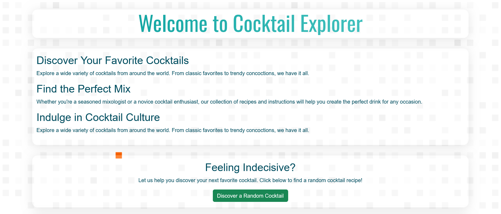
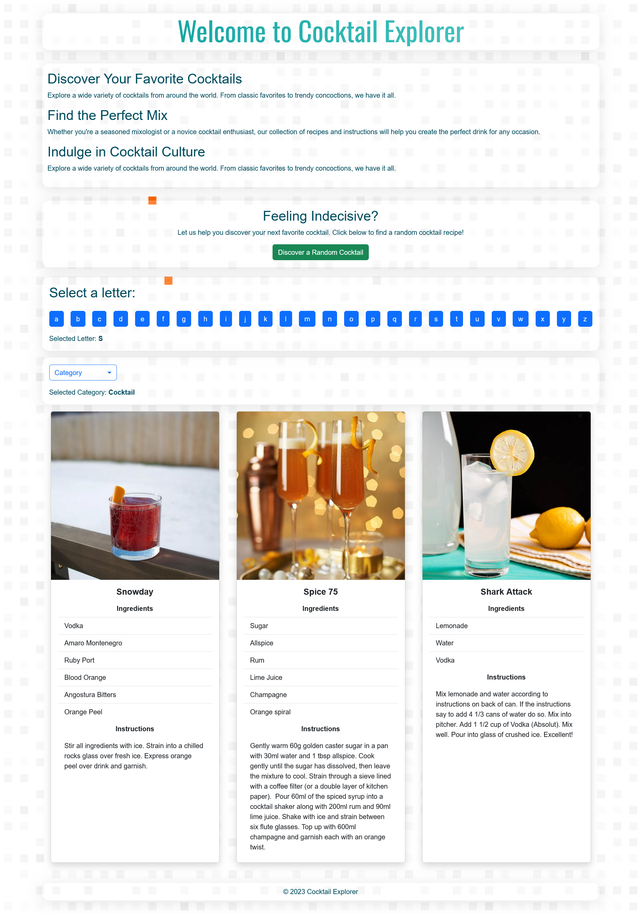

# Desafío - Prueba de Conocimientos en React

En este desafío, he construido una aplicación en React que consume una API de cócteles. La aplicación permite buscar cócteles por letra, filtrar por categoría y obtener un cocktail de forma aleatoria.

## Video Explicativo 📹

El video explicativo de la aplicación se encuentra disponible en [YouTube](https://www.youtube.com/watch?v=).

## Capturas de Pantalla 🖼️

### Landing Page

### Resultados de la Búsqueda

### Filtrado por Categoría

## Requerimientos del Desafío 🎯

1. **Limpieza de Archivos e Importaciones:** Se han eliminado archivos e importaciones innecesarios siguiendo las buenas prácticas de desarrollo en React.

2. **Creación de una Landing Page:** Se ha creado una página de inicio para la aplicación.

3. **Consumo de la API:** Se ha creado un componente `MiApi.jsx` para consumir la API de cócteles.

4. **Mostrar Resultados de la API:** Se han mostrado los resultados de la API en la aplicación.

5. **Implementación de un Buscador:** Se ha creado un componente de buscador que filtra los resultados por letra.

6. **Ordenación de Resultados:** Los resultados se ordenan en base a una serie de categorías.

7. **Diseño Coherente:** Se ha agregado un diseño coherente a la aplicación utilizando Bootstrap.

## API Utilizada: TheCocktailDB

He integrado la API de TheCocktailDB para proporcionar datos sobre una amplia variedad de cócteles. Esta API ofrece acceso a una extensa base de datos de recetas de cócteles, permitiendo buscar información sobre ingredientes, instrucciones de preparación, imágenes y más.

**Enlace a la API:** [TheCocktailDB API](https://www.thecocktaildb.com/api.php)

## Tecnologías Utilizadas 💻

- React
- CSS
- Bootstrap

## Estructura del Código 🧱

El código de la aplicación está estructurado utilizando React, con componentes individuales para la página de inicio, el componente de búsqueda y el consumo de la API de cócteles. Se ha utilizado Bootstrap para estilizar la aplicación y CSS para estilos adicionales.

## Mejoras Futuras 🚀

Para futuras iteraciones de la aplicación, se podría considerar agregar funcionalidades adicionales como la visualización detallada de cada cóctel, la posibilidad de guardar cócteles favoritos y la implementación de un sistema de autenticación para usuarios.